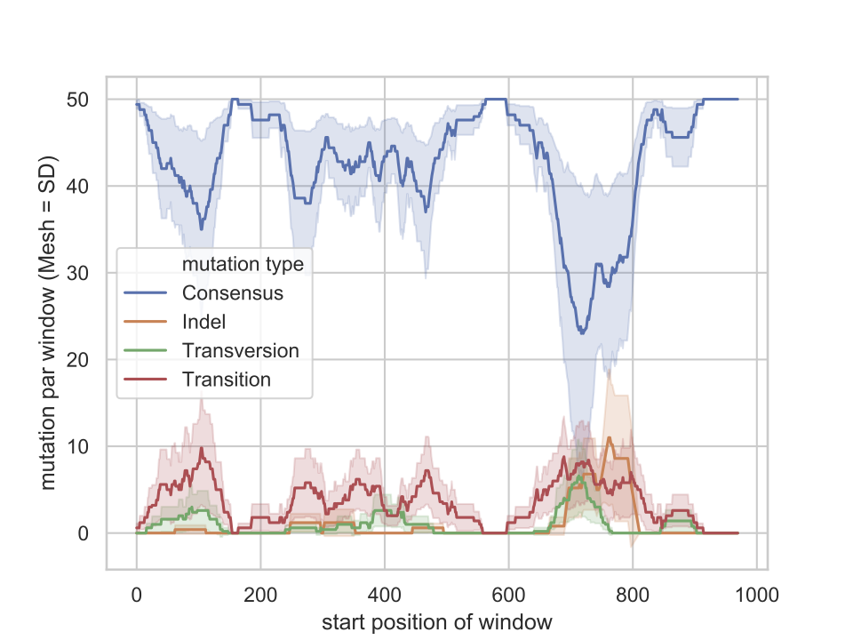

# AliVa; Simple nucleaotide variation counter
====

AliVa is a simple counter and visualizar of aligned nucleotide sequence variation. AliVa counts the  indel/transition/transversion numbers from an multiple aligned nulceotide sequence file, and visularize the distribution of the variation with multiple plots. Our main purpose is the understanding of variation-enriched region on the aligned sequences. We split the alignemt with given window size (dafault = 50 bp), and caluclate the number of variation in each window. The variations will be counted via round robin among all aligned sequences and raw data will output to "result_rawdata.txt" file, and the mean values will described on "average.txt" file. The main output plot is "line_all.pdf" which visualize the distribution of the variations. 

## Output example




## Requirement

Python 3.7. (Biopython, pandas, argparse, matplotlib, seaborn, numpy)

## Usage
```sh
usage: aliva.py [-h] -f FASTA [-w WIN] [-p]

optional arguments:
  -h, --help            show this help message and exit
  -f FASTA, --fasta FASTA
                        File path to a genome sequence file
  -w WIN, --win WIN     window size (bp) (default = 50)
  -p, --plot            Manualy modify the plot with seaborn window


```

## Demo
```sh

aliva.py -f ./test/test.fa 

```


## Licence
[MIT License](http://opensource.org/licenses/mit-license.php)

## Author
[Taro Maeda](https://github.com/maedat)
